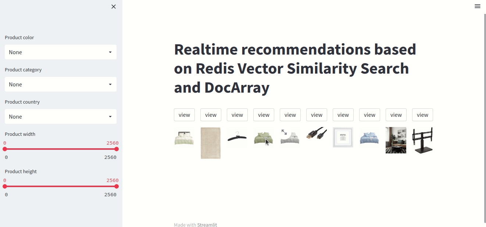

# Real-time product recommendation using Redis and DocArray
This project is a demo of real-time product recommendation using Redis and DocArray.
This real-time recommendation relies on VSS to recommend visually similar products that satisfy a set of user filters.
Recommendations are based on user session data which consists of weighted average of the last k visited products.

## About the dataset:
The dataset is derived from the "[Amazon Berkeley Objects Dataset](https://amazon-berkeley-objects.s3.amazonaws.com/index.html)".
It comes in a DocArray format from Jina Cloud available using the following keys:
- 'amazon-berkeley-objects-dataset': pre-processed subset of the Amazon Berkeley Objects Dataset in DocArray format.
- 'amazon-berkeley-objects-dataset-encoded': encoded version of `'amazon-berkeley-objects-dataset'` using [CLIP-as-service](https://clip-as-service.jina.ai)
 to encode images.

This project uses `amazon-berkeley-objects-dataset-encoded` by default. If you want to use different embeddings (for 
instance, by encoding mesh data):
1. Pull the dataset from Jina Cloud: `da = DocumentArray.pull('amazon-berkeley-objects-dataset')`
2. Encode the data using any model of your choice
3. Push the dataset to the Cloud: `da.push('my-da-name')`
4. Set the `DATASET_NAME` environment variable before running the application: `export DATASET_NAME=my-da-name`

## Run the application:

### Using Docker Compose
In order to run the application with Docker Compose, make sure to follow these steps:
1. Create a personal access token for Jina AI Cloud. You can read how to accomplish that [here](https://docs.jina.ai/jina-ai-cloud/login/).

2. Afterwards, create a `.env` file and keep the personal access token there as an environment variable under the name JINA_AUTH_TOKEN.

3. Run `docker-compose up` and access the streamlit application at http://localhost:8501/
   
### Running locally
In order to run the application locally, follow the commands provided in `run.sh` bash script.

## Demo

